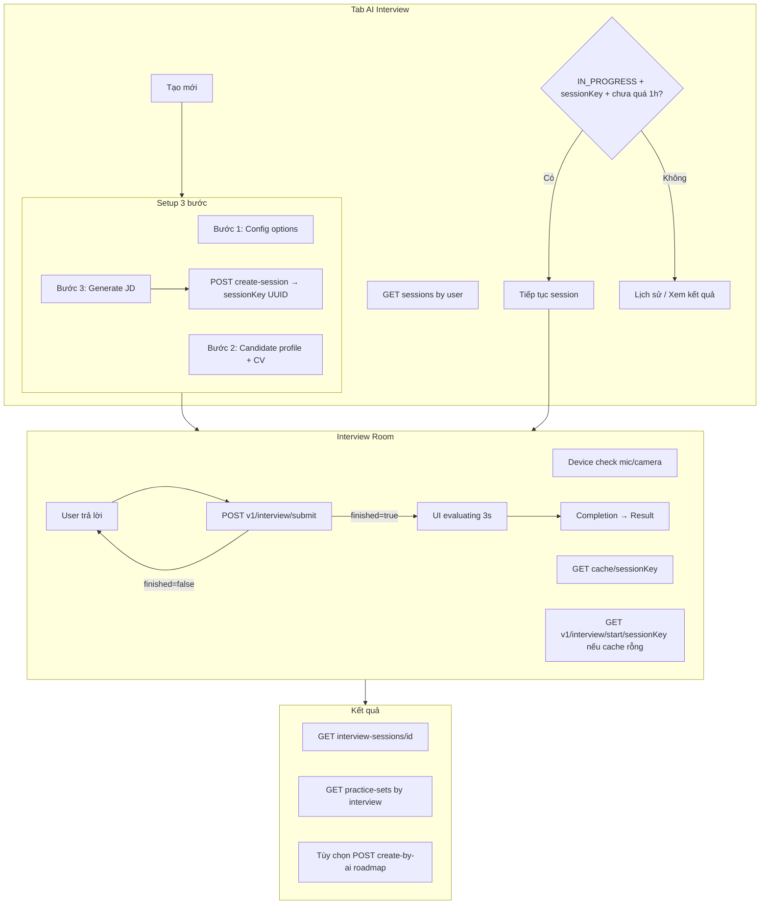
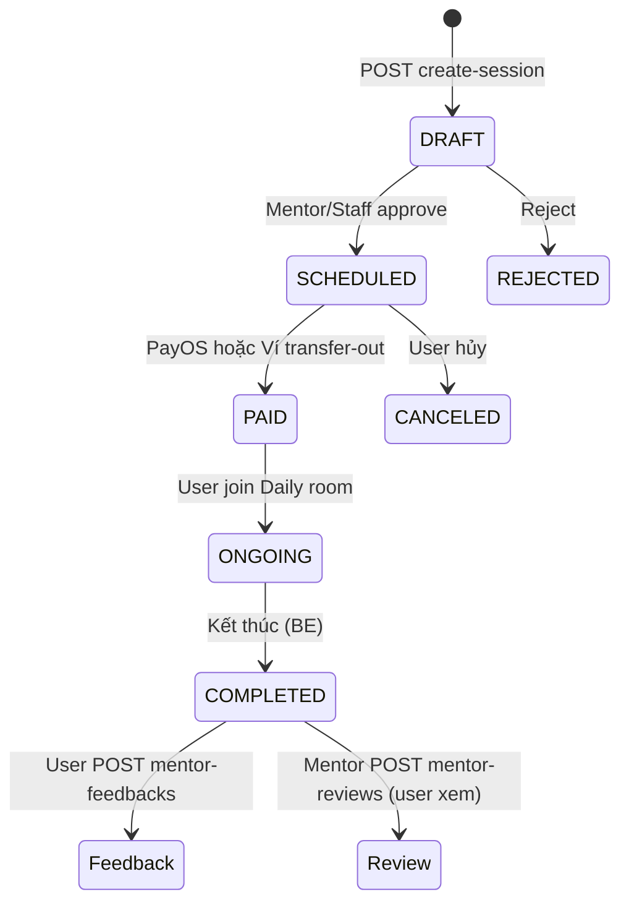
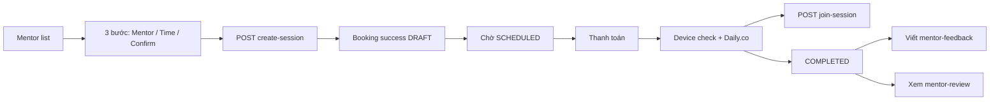

# INBLUE Mobile Implementation Guide

> **Phiên bản:** 2026-05-21  
> **Nguồn sự thật:** Repo frontend `EXE_FE` (`exe-fe`) — branch `main` sau `git pull` (commit `9f528db`).  
> **Deploy tham chiếu:** https://inblue-fpt-zeta.vercel.app/  
> **Backend:** Spring Boot — OpenAPI `GET {VITE_API_BASE_URL}/v3/api-docs` → file `schema-from-be.d.ts`  
> **Phạm vi tài liệu:** User role — **AI Interview** + **Mock Interview with Mentor** (Flutter).

---

## Mục lục

1. [Bối cảnh & kiến trúc web](#0-bối-cảnh--kiến-trúc-web)
2. [A. Tổng quan hai tính năng (flow end-to-end)](#a-tổng-quan-hai-tính-năng-flow-end-to-end)
3. [B. API Contracts](#b-api-contracts)
4. [C. State Management Strategy (Flutter)](#c-state-management-strategy-flutter)
5. [D. UI/UX Detailed Specification](#d-uiux-detailed-specification)
6. [E. Kiosk Mode / Immersive Interview Room](#e-kiosk-mode--immersive-interview-room)
7. [F. Realtime (WebSocket STOMP) & Notifications](#f-realtime-websocket-stomp--notifications)
8. [G. Design System & Theme](#g-design-system--theme)
9. [Phụ lục](#phụ-lục)

---

## 0. Bối cảnh & kiến trúc web

### 0.1 Stack frontend (tham chiếu parity)

| Layer | Công nghệ |
|-------|-----------|
| UI | React 19, Tailwind 4, shadcn/Radix |
| Routing | React Router 7 — User shell `/user` + nested routes |
| Server state | TanStack Query + openapi-react-query (`$api`) **và** Axios managers |
| Client state | Zustand + `persist` (localStorage) |
| Video | `@daily-co/daily-js` (iframe `createFrame`) |
| Chat realtime | SockJS + STOMP (`@stomp/stompjs`) — **chỉ messenger** |
| Speech AI room | Web Speech API (STT/TTS) — **không qua BE** |

### 0.2 Cấu trúc thư mục liên quan mobile

```
src/
├── App.tsx                          # Toàn bộ route
├── lib/api.ts                       # $api (openapi-fetch + JWT middleware)
├── constants/api.config.ts          # Endpoints, ERROR_MESSAGES, Axios
├── constants/colors.ts              # Palette #0047AB
├── constants/notification-types.ts  # Phân loại thông báo theo title
├── interfaces/schema.types.ts       # Session, SessionStatus, ...
├── schema-from-be.d.ts              # OpenAPI generated — KHÔNG sửa tay
├── services/
│   ├── session.manager.ts           # Mock interview sessions
│   ├── mentor.manager.ts
│   ├── mentor-feedback.manager.ts
│   ├── mentor-review.manager.ts
│   ├── notification.manager.ts
│   ├── transaction.manager.ts
│   └── candidate-profile.manager.ts
├── hooks/                           # useSession, useMentor, useNotificationAlerts, ...
├── pages/User/
│   ├── AIInterview/                 # List, Setup, Session, Result
│   ├── MockInterview/               # Schedule, Room, History, WriteReview
│   └── UserDashboard/               # ChromeTabs shell
└── components/video-call/           # Daily.co provider
```

### 0.3 Environment & base URL

| Biến | Mặc định (dev) | Ghi chú |
|------|----------------|---------|
| `VITE_API_BASE_URL` | `http://localhost:8080` | Production thường `https://api.kdz.asia` |
| `VITE_DEBUG_CURL` | — | Log curl Axios (dev) |

**Mobile `.env` gợi ý:**

```env
API_BASE_URL=https://api.kdz.asia
# hoặc staging/local
```

Mọi request (trừ auth public) cần header:

```http
Authorization: Bearer <JWT>
Content-Type: application/json
```

**Lưu ý:** Web có hai client — `$api` (openapi) và Axios `createApiInstance()`. Cả hai đều gắn Bearer từ store. Mobile chỉ cần **một** HTTP client + interceptor 401.

### 0.4 Auth (bắt buộc trước mọi feature)

| Method | Path | Body | Response |
|--------|------|------|----------|
| `POST` | `/api/auth/login` | `{ "email": string, "password": string }` | **JWT string** (plain text / `*/*`) |
| `POST` | `/api/auth/login-with-google` | (OAuth flow web) | JWT |

**Lưu trữ mobile (tương đương web `auth-storage`):**

```json
{
  "isLoggedIn": true,
  "user": { "id", "email", "name", "role": "USER", ... },
  "token": "<jwt>",
  "expiresAt": <unix_ms từ JWT exp>
}
```

**401:** Xóa token, navigate Login. Message: `Phiên đăng nhập hết hạn. Vui lòng đăng nhập lại.`

**User profile bổ sung:**

| Method | Path | Mục đích |
|--------|------|----------|
| `GET` | `/api/users/{userId}/subscription` | Quota AI interview (`maxAiInterview`, `aiInterviewRemaining`, …) |
| `GET` | `/api/users/find-by-id/{userId}` | Wallet balance (thanh toán mock) |

### 0.5 Endpoint LEGACY — không dùng

Web **không gọi** các path sau trong flow User (chỉ có trong `api.config.ts`):

- `/api/ai-interviews/*`
- `/api/mock-interviews/*`

Mobile **không implement** trừ khi backend xác nhận lại.

---

## A. Tổng quan hai tính năng (flow end-to-end)

### A.1 AI Interview (Virtual AI Interview Room)

#### A.1.1 Mục tiêu sản phẩm

Ứng viên cấu hình buổi phỏng vấn AI (mode, độ khó, ngôn ngữ JD, thời lượng), upload/chỉnh CV & JD, nhận câu hỏi tuần tự từ AI, trả lời **text hoặc voice**, xem báo cáo điểm + lộ trình luyện tập sau khi hoàn thành.

#### A.1.2 Sơ đồ luồng



#### A.1.3 Route web (map sang mobile navigation)

| Web route | Mobile screen gợi ý |
|-----------|---------------------|
| `/user?tab=aiInterview` | `AiInterviewListScreen` |
| `/user/ai-interview/setup` | `AiInterviewSetupScreen` (PageView 3 bước) |
| `/user/ai-interview/session?sessionKey=` | `AiInterviewRoomScreen` |
| `/user/ai-interview/result/:id` | `AiInterviewResultScreen` (`id` = **numeric DB id**) |

#### A.1.4 Khái niệm ID quan trọng

| ID | Kiểu | Dùng khi |
|----|------|----------|
| `sessionKey` | UUID string | Live room: start, submit, cache |
| `id` / `dbId` | int | Result page, practice sets, list history |

**TTL phiên live:** 1 giờ (`SESSION_EXPIRY_MS = 3_600_000`) kể từ `createdAt`. Hết hạn → message lỗi chứa `not found` / `expired` / `404`.

#### A.1.5 Trạng thái UI trong phòng (không có enum `thinking` trên BE)

| State FE | Kích hoạt | Copy tiếng Việt (web) |
|----------|-----------|------------------------|
| `isStarting` | Chờ GET start | Spinner toàn màn |
| `isCacheLoading` | Chờ cache | — |
| `isSubmitting` | POST submit đang chạy | "AI đang xử lý câu trả lời vừa gửi" |
| `isEvaluating` | `finished=true`, delay 3s | "AI đang đánh giá phản hồi của bạn" |
| `isListening` | STT đang ghi | "Đang thu âm câu trả lời của bạn" |
| `interviewFinished` | Kết thúc | "Phỏng vấn hoàn tất..." |
| `sessionExpiredMidway` | Lỗi expiry khi submit | "Phiên đã hết hạn..." |

**Web chưa có Kiosk mode** — mục [E](#e-kiosk-mode--immersive-interview-room) định nghĩa yêu cầu cho mobile.

#### A.1.6 Speech & camera (client-side)

- **STT:** Web Speech API — mobile dùng `speech_to_text` / platform STT.
- **TTS:** Web Speech + ResponsiveVoice (`VITE_RESPONSIVE_VOICE_KEY`) — mobile dùng `flutter_tts` hoặc cloud TTS.
- **Ngôn ngữ speech UI:** `vi-VN` | `en-US` — **độc lập** với `session_config.language` (`VI` | `EN`).
- **Camera:** Chỉ preview local (`getUserMedia`) — **không upload frame** trong flow web hiện tại.
- **Mic:** Tap toggle → stop lần 2 **auto-send** draft (`resolveAutoSendDraft`).
- **Nhắc sau 5 phút** ghi âm liên tục.

**localStorage keys (map → SharedPreferences / secure storage):**

| Key | Giá trị |
|-----|---------|
| `interview-session-keys` | `{ [sessionKey]: { createdAt } }` |
| `interview-finished-{sessionKey}` | `"true"` |
| `interview-session-id-{sessionKey}` | numeric `dbId` fallback |
| `tts-muted` | `"true"` / `"false"` |

---

### A.2 Mock Interview with Mentor

#### A.2.1 Mục tiêu sản phẩm

User chọn mentor, đặt lịch (`joinTime`), tạo phiên (DRAFT → duyệt → SCHEDULED → thanh toán → PAID → video Daily.co → COMPLETED → feedback/review).

#### A.2.2 Sơ đồ luồng





#### A.2.3 Route web → mobile

| Web route | Mobile screen |
|-----------|---------------|
| `/user?tab=mockInterview` | `MockInterviewListScreen` |
| `/user/mock-interview/schedule` | `MockInterviewScheduleScreen` |
| `/user/mock-interview/booking-success` | `BookingSuccessScreen` |
| `/user/mock-interview/history/:sessionId` | `SessionDetailScreen` (+ payment) |
| `/user/mock-interview/room/:sessionId` | `VideoCallScreen` |
| `/user/mock-interview/history/:sessionId/feedback` | `WriteMentorFeedbackScreen` |
| `/user?tab=interviewHistory` | `SessionHistoryScreen` |
| `/user/feedback/:id` | `MentorReviewDetailScreen` |
| `/user/mentors/:mentorId` | `MentorDetailScreen` → deep link schedule |

#### A.2.4 Điều kiện join phòng (parity web)

```dart
bool canJoin(Session s) =>
  (s.status == 'PAID' || s.status == 'ONGOING') &&
  s.roomUrl != null &&
  s.roomUrl!.isNotEmpty &&
  currentUser != null;

// List "Tham gia": thêm joinTime <= now (refresh mỗi 30s)
```

#### A.2.5 Hai loại phản hồi (dễ nhầm)

| UI label | API entity | Ai tạo | Endpoint |
|----------|------------|--------|----------|
| "Viết phản hồi" | `MentorFeedback` | **User** | `POST /api/mentor-feedbacks` |
| "Đánh giá từ Mentor" | `MentorReview` | **Mentor** | `GET /api/mentor-reviews` |

Validation feedback user: `rating > 0` **hoặc** `comment` non-empty.

#### A.2.6 Thanh toán (tóm tắt — chi tiết mục B)

1. **PayOS:** `GET /api/sessions/make-payment?sessionId=` → redirect URL → callback `/payment/success` → deep link history + poll PAID.
2. **Ví:** `POST /api/transactions/transfer-out?amount=&userId=&paymentPurpose=MENTOR_INTERVIEW` → có thể cần `PUT /api/sessions` sync `status: PAID` (workaround FE).
3. **Pending context:** key `inblue.session-payment.pending` (TTL 2h).

---

## B. API Contracts

> **Quy ước lỗi chung:** Parse body JSON → `message` / `error` / `detail` / `errors[field]`. Map HTTP status qua bảng dưới. Pattern đặc biệt trong `lib/error-normalizer.ts`.

### B.0 Bảng xử lý lỗi HTTP (bắt buộc implement)

| Status | Message mặc định (VI) |
|--------|------------------------|
| 400 | Dữ liệu không hợp lệ. Vui lòng kiểm tra lại. |
| 401 | Phiên đăng nhập hết hạn. Vui lòng đăng nhập lại. |
| 403 | Bạn không có quyền thực hiện thao tác này. |
| 404 | Không tìm thấy dữ liệu yêu cầu. |
| 409 | Dữ liệu bị xung đột. Vui lòng thử lại. |
| 413 | Tập tin quá lớn. Vui lòng chọn file nhỏ hơn. |
| 429 | Quá nhiều yêu cầu. Vui lòng thử lại sau. |
| 500 | Hệ thống đang gặp sự cố. Vui lòng thử lại sau. |
| 503 | Dịch vụ đang bảo trì. Vui lòng thử lại sau. |
| 504 | Máy chủ phản hồi quá chậm. Vui lòng thử lại. |

**Pattern message theo nội dung (regex):**

| Pattern | Message |
|---------|---------|
| `insufficient balance` | Số dư ví không đủ... |
| `session not found` | Không tìm thấy phiên phỏng vấn. |
| `not found` / `expired` / `404` (AI submit) | Phiên hết hạn sau 1 giờ không hoạt động |

**Network error:** `Không thể kết nối đến máy chủ. Vui lòng kiểm tra kết nối mạng.`

---

### B.1 AI Interview — Endpoints

#### B.1.1 `GET /api/interview-sessions/config-options`

| | |
|--|--|
| **Auth** | Bearer |
| **Query** | — |
| **Response 200** | Object map category → array options |

```typescript
// FE cast: InterviewConfigOptions
{
  interview_modes: { key, label, description }[];
  languages: { key, label, description }[];
  difficulties: { key, label, description }[];
  domains: { key, label, description }[];
}
```

**Enum keys dùng khi create:**

| Field | Values |
|-------|--------|
| `interview_mode` | `STANDARD_MOCK`, `THEORY_CHECK`, `PROJECT_DEFENSE` |
| `difficulty` | `FRESHER_BASIC`, `FRESHER_ADVANCED` |
| `language` | `VI`, `EN` |
| `domain` | `IT`, `NON_IT` |
| `duration_minutes` | `15`, `30`, `45`, `60` |

**Lỗi:** Toast generic "Không thể tải cấu hình".

---

#### B.1.2 `POST /api/interview-sessions/generate-job-requirement`

| | |
|--|--|
| **Content-Type** | `application/json` |
| **Body** | **Plain string** — mô tả JD (không bọc object!) |
| **Response 200** | `JobRequirementData` |

```json
{
  "basic_info": {
    "job_title": "string?",
    "industry_domain": "string?",
    "seniority_level": "string?"
  },
  "competencies": {
    "hard_skills": ["string"],
    "soft_skills": ["string"],
    "tools_and_platforms": ["string"]
  },
  "responsibilities": ["string"]
}
```

**Lỗi:** Toast "Không thể tạo yêu cầu công việc".

---

#### B.1.3 `POST /api/interview-sessions/create-session`

| | |
|--|--|
| **Body** | `InterviewSetupRequest` |

```json
{
  "user_id": 123,
  "candidate_profile": { /* CandidateProfile đầy đủ từ GET/POST profile */ },
  "job_requirement": { /* JobRequirementData */ },
  "session_config": {
    "duration_minutes": 30,
    "interview_mode": "STANDARD_MOCK",
    "difficulty": "FRESHER_BASIC",
    "language": "VI",
    "domain": "IT"
  }
}
```

| | |
|--|--|
| **Response 200** | **Plain text UUID** `sessionKey` (có thể có quotes — FE strip + regex validate UUID) |
| **Content-Type** | `*/*` / text |

**Sau success:** Navigate `AiInterviewRoomScreen(sessionKey)`, lưu `interview-session-keys`.

**Lỗi:** Toast + hiển thị `Error.message`.

---

#### B.1.4 Candidate Profile (Setup bước 2)

| Method | Path | Body / Notes |
|--------|------|----------------|
| `GET` | `/api/candidate-profiles/{userId}` | → `CandidateProfile` |
| `POST` | `/api/candidate-profiles` | Body có `id: 0` khi tạo mới |
| `PUT` | `/api/candidate-profiles` | Body có `id` thật khi update |
| `POST` | `/api/users/upload-cv` | `multipart/form-data`: `userId` (Blob JSON string), `cvFile` (PDF only) → `CandidateProfile` |

---

#### B.1.5 `GET /api/interview-sessions/user/{userId}`

**Response:** `InterviewSession[]`

```typescript
interface InterviewSession {
  id?: number;                    // DB id — dùng cho result
  sessionKey?: string;            // UUID — dùng cho room
  user?: User;
  blueprint?: InterviewBlueprintResponse;
  candidateProfile?: CandidateProfile;
  jobRequirement?: JobRequirementData;
  sessionConfig?: SessionConfigData;
  mode?: "STANDARD_MOCK" | "THEORY_CHECK" | "PROJECT_DEFENSE";
  domain?: "IT" | "NON_IT";
  status?: "CREATED" | "IN_PROGRESS" | "COMPLETED" | "CANCELLED";
  createdAt?: string;
  updatedAt?: string;
  completedAt?: string;
  overallScore?: number;
  result?: "STRONG_HIRE" | "HIRE" | "CONSIDER" | "REJECT";
  resultDetail?: InterviewResultDetail;
}
```

**Active session (FE logic):** `status === "IN_PROGRESS"` + `sessionKey` + `!isSessionExpired(createdAt)`.

---

#### B.1.6 `GET /api/interview-sessions/cache/{sessionKey}`

**Response:** `InterviewSessionRedis`

```json
{
  "id": "string?",
  "dbId": 42,
  "currentPhaseIndex": 0,
  "currentQuestionIndex": 2,
  "currentQuestionText": "string?",
  "currentQuestionType": "BLUEPRINT | FOLLOW_UP",
  "chatHistory": [
    {
      "phaseName": "string?",
      "questionId": 1,
      "questionOrder": 1,
      "questionText": "string?",
      "answerText": "string?",
      "submittedAt": "string?",
      "type": "BLUEPRINT | FOLLOW_UP"
    }
  ],
  "blueprint": { "strategy_analysis": "...", "blueprint": [...] }
}
```

**Dùng để:** Khôi phục chat khi mở lại room; lấy `dbId` cho navigation result.

---

#### B.1.7 `GET /api/v1/interview/start/{sessionKey}`

| | |
|--|--|
| **Path param** | `sessionKey` (UUID) |
| **Khi gọi** | Chỉ khi cache **không** có `chatHistory` và **không** có `currentQuestionText` |
| **Response 200** | `QuestionResponse` (xem B.1.9) |

**Lỗi start:** Nếu message chứa `not found` | `expired` | `404` → full-page "Phiên hết hạn/không tồn tại".

---

#### B.1.8 `POST /api/v1/interview/submit`

| | |
|--|--|
| **Body** | `SubmitAnswerRequest` |

```json
{
  "sessionKey": "uuid-string",
  "answer": "Nội dung câu trả lời của user"
}
```

| | |
|--|--|
| **Response 200** | `QuestionResponse` |

**FE behavior:**

1. Append user message vào chat **trước** khi gọi API (optimistic).
2. Success → invalidate cache query.
3. `finished === true` → `isEvaluating` 3 giây → completion UI.
4. Catch expiry → `sessionExpiredMidway`, AI bubble thông báo hết hạn 1h.

---

#### B.1.9 `QuestionResponse` (start + submit)

```json
{
  "sessionKey": "uuid?",
  "phaseName": "string?",
  "currentQuestionIndex": 0,
  "totalQuestionsInPhase": 5,
  "questionContent": "Câu hỏi AI?",
  "questionType": "string?",
  "finished": false
}
```

Khi `finished: true` → không có câu hỏi tiếp; trigger evaluating flow.

---

#### B.1.10 `GET /api/interview-sessions/{sessionId}`

| | |
|--|--|
| **Path param** | `sessionId` = **numeric** DB id |
| **Response** | `InterviewSession` đầy đủ + `resultDetail` |

```typescript
interface InterviewResultDetail {
  aiOverviewFeedback?: string;
  improvementPlan?: string;
  history?: QAResult[];
}

interface QAResult {
  questionType?: string;
  questionOrder?: number;
  questionText?: string;
  answerText?: string;
  feedback?: string;
  score?: number;
  suggestion?: string;
  behavioralWarnings?: string[];
}
```

---

#### B.1.11 Practice set sau AI interview

| Method | Path | Body |
|--------|------|------|
| `GET` | `/api/practice-sets/interview-session/{interviewSessionId}` | — |
| `POST` | `/api/practice-sets/create-by-ai` | `{ "aiInterviewId": number, "dateNumber": 7 \| 14 }` |

---

#### B.1.12 Endpoints có trên schema nhưng web chưa dùng (mobile phase 2)

| Method | Path | Ghi chú |
|--------|------|---------|
| `POST` | `/api/interview-analysis/face-behavior` | Proctoring |
| `POST` | `/api/v1/proctoring/track` | `FaceSnapshotRequest` |

```json
// FaceSnapshotRequest
{
  "sessionKey": "uuid",
  "globalQuestionOrder": 1,
  "imageBase64": "..."
}
```

---

### B.2 Mock Interview — Endpoints

#### B.2.1 `GET /api/mentors`

**Response:** `MentorResponse[]` (FE lọc `active !== false`)

```typescript
interface MentorResponse {
  id?: number;
  name?: string;
  email?: string;
  bio?: string;
  avatarUrl?: string;
  expertise?: string;
  yearsOfExperience?: number;
  linkedInUrl?: string;
  currentCompany?: string;
  rate?: number;              // legacy
  pricePerMinute?: number;    // dùng tính giá
  averageRating?: number;
  totalSession?: number;
  active?: boolean;
}
```

**Giá:** `totalPrice = durationMinutes * mentor.pricePerMinute` (bắt buộc `pricePerMinute > 0`).

---

#### B.2.2 `GET /api/mentors/{id}`

Chi tiết mentor trên `SessionDetailScreen`.

---

#### B.2.3 `POST /api/sessions/create-session`

| | |
|--|--|
| **Body** | `SessionCreationRequest` |

```json
{
  "userId": 1,
  "mentorId": 2,
  "joinTime": "2026-05-21T10:00:00.000Z",
  "duration": 60,
  "totalPrice": 300000,
  "dailyCoCreationRequest": {
    "name": "",
    "privacy": "public",
    "properties": {
      "max_participants": 2,
      "start_video_off": true,
      "start_audio_off": true,
      "enable_screenshare": true,
      "exp": 0,
      "enable_recording": "cloud"
    }
  }
}
```

| | |
|--|--|
| **Response 200** | `Session` object (schema `SessionResponse` / FE `Session`) |

**Timezone:** Web build `joinTime` từ selection **giờ Việt Nam** → ISO UTC (`formatToVietnamISOString`).

**Sau success:** `status` thường `DRAFT` → `BookingSuccessScreen`.

---

#### B.2.4 `GET /api/sessions/{userId}/by-user`

**Response:** `Session[]`

```typescript
type SessionStatus =
  | "DRAFT" | "SCHEDULED" | "PAID" | "REJECTED"
  | "ONGOING" | "COMPLETED" | "CANCELED";

interface Session {
  id?: number;
  roomName?: string;
  userId?: number;           // candidate (user hiện tại)
  userId2?: number;          // mentor — KHÔNG đảo với userId
  participantId1?: string;
  startTime1?: string;
  endTime1?: string;
  durationSeconds1?: number;
  participantId2?: string;
  startTime2?: string;
  endTime2?: string;
  durationSeconds2?: number;
  roomUrl?: string;
  joinTime?: string;
  recordUrl?: string;
  status?: SessionStatus;
  duration?: number;         // phút (kế hoạch)
  totalPrice?: number;
  transactionCode?: string;
}
```

---

#### B.2.5 `GET /api/sessions/{id}`

Chi tiết một phiên — payment, join, feedback.

---

#### B.2.6 `PUT /api/sessions`

**Dùng cho:** Hủy (`status: CANCELED`), **sync PAID** sau ví.

```json
{
  "id": 10,
  "userId": 1,
  "userId2": 2,
  "status": "PAID",
  "joinTime": "ISO",
  "roomName": "session-10",
  "roomUrl": "https://...",
  "totalPrice": 300000,
  "transactionCode": "optional"
}
```

**Retry FE:** `markSessionAsPaidWithRetry` — 3 lần, backoff.

---

#### B.2.7 `GET /api/sessions/make-payment`

| | |
|--|--|
| **Query** | `sessionId` (number) |
| **Response** | URL string **hoặc** nested object |

FE extract theo thứ tự: `checkoutUrl` | `paymentUrl` | `redirectUrl` | `link` | `url` | `data.*`

**Mobile:** Mở in-app browser / `url_launcher` → PayOS → deep link callback.

---

#### B.2.8 `POST /api/transactions/transfer-out`

| | |
|--|--|
| **Query params** | `amount` (int), `userId` (int), `paymentPurpose=MENTOR_INTERVIEW` |
| **Body** | `null` |
| **Response** | `TransferOutResult` (text hoặc JSON) |

```typescript
interface TransferOutResult {
  message?: string;
  transactionCode?: string;
  currentBalance?: number;
  status?: string;
  redirectUrl?: string;  // edge case: vẫn redirect PayOS
}
```

**Sau success (không redirectUrl):** Gọi `PUT /api/sessions` sync PAID + poll `GET /api/sessions/{id}`.

---

#### B.2.9 `POST /api/sessions/join-session`

| | |
|--|--|
| **Body** | Xem bảng dưới |

**OpenAPI schema:** `JoinSessionDtoRequest` field `mentor?: boolean`  
**Web production gửi:** `isMentor: boolean` — **bắt buộc true/false, không null**

```json
{
  "sessionName": "<session.roomName>",
  "userId": 1,
  "participantId": "<daily_local_participant_session_id>",
  "isMentor": false
}
```

> **Khuyến nghị mobile:** Gửi `isMentor` như web; nếu BE reject, thử `mentor` (cùng giá trị). Gọi sau event Daily `joined-meeting`.

---

#### B.2.10 `GET /api/sessions/update-status` (không phải User UI chính)

| Query | `sessionId`, `isApproved` (boolean) |
| Dùng | Mentor/Staff duyệt DRAFT → SCHEDULED / REJECTED |

---

#### B.2.11 Mentor Feedback (user → mentor)

| Method | Path | Body |
|--------|------|------|
| `GET` | `/api/mentor-feedbacks` | List — FE filter `session.id` client-side |
| `GET` | `/api/mentor-feedbacks/{id}` | — |
| `POST` | `/api/mentor-feedbacks` | `CreateMentorFeedbackRequest` |
| `PUT` | `/api/mentor-feedbacks` | `{ id, rating?, comment? }` |

```json
// CreateMentorFeedbackRequest
{
  "sessionId": 10,
  "mentorId": 2,
  "userId": 1,
  "rating": 5,
  "comment": "string?"
}
```

**Điều kiện:** `session.status === "COMPLETED"` && `session.userId === currentUser.id`.

---

#### B.2.12 Mentor Review (mentor → user)

| Method | Path |
|--------|------|
| `GET` | `/api/mentor-reviews` |
| `GET` | `/api/mentor-reviews/{id}` |

```typescript
interface MentorReview {
  id?: number;
  session?: Session;
  mentor?: Mentor;
  user?: User;
  rating?: number;
  situationNote?: string;  // STAR
  taskNote?: string;
  actionNote?: string;
  resultNote?: string;
  strength?: string;
  weakness?: string;
  improve?: string;
}
```

---

### B.3 Notifications (REST — không realtime cho interview)

| Method | Path | Ghi chú |
|--------|------|---------|
| `GET` | `/api/notifications/{userId}` | List |
| `POST` | `/api/notifications` | Admin tạo |
| `GET` | `/api/notifications/check-read/{notificationId}` | Đánh dấu đã đọc |

```typescript
interface Notification {
  id?: number;
  user?: User;
  title?: string;
  message?: string;
  isRead?: boolean;
  createAt?: string;  // chú ý typo BE: createAt không phải createdAt
}
```

**Polling gợi ý mobile:** 30–60s khi app foreground; pull-to-refresh on tab Notifications.

---

### B.4 Daily.co (client SDK — không phải REST)

| Bước | Hành động |
|------|-----------|
| 1 | Nhận `roomUrl` từ `Session` sau create / update |
| 2 | Normalize URL: thêm `https://` nếu thiếu protocol |
| 3 | Join với Daily Flutter SDK (`daily_flutter` hoặc WebView wrapper) |
| 4 | `userName` = `user.name` hoặc email |
| 5 | On joined → `POST join-session` với `participantId` từ Daily |
| 6 | On leave → pop về `MockInterviewListScreen` |
| 7 | Lỗi `exp-room` / room unavailable → UI "Phòng đã hết hạn" + nút quay lại |

**Package web:** `@daily-co/daily-js` — `DailyIframe.createFrame` + `join({ userName })`.

---

## C. State Management Strategy (Flutter)

### C.1 Đề xuất: **Riverpod 2.x** (+ code generation tùy chọn)

| Tiêu chí | Riverpod | Bloc | Provider |
|----------|----------|------|----------|
| Async/API | `AsyncNotifier` tích hợp tốt | `Bloc` + repo riêng | Cần boilerplate |
| DI / test | Mạnh, compile-safe | Tốt | Trung bình |
| Local persist | + `shared_preferences` / `hive` | + hydrate | + |
| Phù hợp scale Capstone | ✅ | ✅ (nặng hơn) | ⚠️ nhỏ |

**Không bắt buộc Bloc** trừ khi team đã chuẩn hóa Bloc — Riverpod gần với pattern React Query + Zustand hơn.

### C.2 Tách state theo layer

```
┌─────────────────────────────────────────────────────────┐
│  UI (Screens / Widgets)                                  │
├─────────────────────────────────────────────────────────┤
│  Controllers (Riverpod Notifier / AsyncNotifier)         │
│    - AiInterviewListNotifier                             │
│    - AiInterviewSetupNotifier (3-step wizard)            │
│    - AiInterviewRoomNotifier (chat, submit, speech flags)│
│    - MockInterviewScheduleNotifier                       │
│    - VideoCallNotifier                                   │
│    - NotificationInboxNotifier                           │
├─────────────────────────────────────────────────────────┤
│  Repositories (abstract)                                 │
│    - InterviewRepository, SessionRepository, ...         │
├─────────────────────────────────────────────────────────┤
│  Data sources                                            │
│    - ApiClient (Dio) + AuthInterceptor                   │
│    - SecureStorage (token)                               │
│    - LocalCache (session keys, payment pending)          │
└─────────────────────────────────────────────────────────┘
```

### C.3 Map parity React Query → Riverpod

| Web | Mobile |
|-----|--------|
| `useQuery` + `queryKey` | `@riverpod` `FutureProvider` / `AsyncNotifier` + cache key string |
| `invalidateQueries` | `ref.invalidate(provider)` |
| `useMutation` + toast | `AsyncNotifier` method + `ScaffoldMessenger` / custom toast |
| Zustand `authStore` | `AuthNotifier` + `flutter_secure_storage` |
| Zustand `settingsStore` | `SettingsNotifier` + `shared_preferences` |
| Optimistic chat append | Local `List<ChatMessage>` mutate trước, rollback on error |

### C.4 Provider inventory đề xuất

| Provider | Responsibility |
|----------|----------------|
| `authProvider` | JWT, user, expiry, login/logout |
| `apiClientProvider` | Dio base URL, interceptors |
| `aiInterviewListProvider` | GET user sessions, active/history split |
| `aiInterviewSetupProvider` | Wizard state machine steps 1–3 |
| `aiInterviewRoomProvider` | sessionKey, messages, flags (submitting, evaluating, …) |
| `speechControllerProvider` | STT/TTS, language vi-VN/en-US, mute |
| `cameraPreviewProvider` | Permission + preview only |
| `mockSessionListProvider` | GET by-user, canJoin computation |
| `mockScheduleProvider` | Mentor pick, VN timezone joinTime, price |
| `paymentFlowProvider` | PayOS URL, pending context, poll PAID |
| `videoCallProvider` | Daily join state, join-session side effect |
| `notificationInboxProvider` | GET list, mark read, poll |
| `notificationAlertProvider` | Foreground diff + local notification |

### C.5 Persistence keys (SharedPreferences / Secure)

| Key | Nội dung |
|-----|----------|
| `auth-storage` (secure) | token, user json, expiresAt |
| `interview-session-keys` | Map sessionKey → createdAt |
| `interview-finished-{sessionKey}` | bool |
| `interview-session-id-{sessionKey}` | int dbId |
| `tts-muted` | bool |
| `inblue.session-payment.pending` | JSON payment context |
| `inblue.session-paid-status-sync.v1` | Pending PAID sync queue |
| `settings` | muteSound, muteToast, fontSize |

### C.6 Room state machine (AI Interview) — implement như `AsyncNotifier`

```dart
enum AiRoomPhase {
  loading,
  deviceCheck,
  starting,
  interviewing,
  submitting,
  evaluating,
  finished,
  expired,
  error,
}

// Transitions:
// loading → deviceCheck → (confirm) → starting → interviewing
// interviewing + submit → submitting → interviewing | evaluating
// evaluating (3s timer) → finished
// any + 404/expired → expired
```

---

## D. UI/UX Detailed Specification

### D.1 Navigation tổng thể (User app)

```
Splash → Login → UserShell (BottomNav hoặc Drawer)
  ├── Home / Overview (optional phase 2)
  ├── AI Interview
  │     ├── List
  │     ├── Setup (3 steps)
  │     ├── Room (immersive)
  │     └── Result
  ├── Mock Interview
  │     ├── List (upcoming)
  │     ├── History
  │     ├── Schedule (3 steps)
  │     ├── Booking Success
  │     ├── Session Detail (+ Pay)
  │     ├── Video Room
  │     └── Write Feedback
  ├── Notifications
  └── Account (profile, wallet, membership)
```

**Deep links:**

| URI | Screen |
|-----|--------|
| `inblue://ai-interview/session?sessionKey=` | Room |
| `inblue://ai-interview/result/{id}` | Result |
| `inblue://mock-interview/room/{sessionId}` | Video |
| `inblue://mock-interview/history/{sessionId}?payment=success` | Detail + poll |
| `inblue://payment/success` | Payment resolver |

### D.2 AI Interview — Màn hình chi tiết

#### D.2.1 `AiInterviewListScreen`

| Thành phần | Spec |
|------------|------|
| Header | "Phỏng vấn AI" + nút **Tạo buổi mới** (primary `#0047AB`) |
| Active card | Phiên `IN_PROGRESS` còn hạn — CTA **Tiếp tục** |
| History list | Search theo mode/domain; sort newest |
| Empty | Illustration + "Chưa có buổi phỏng vấn nào" |
| Loading | Shimmer cards (3–5) |
| Error | "Không tải được danh sách" + **Thử lại** |
| Item tap | Completed → Result; khác → disabled hoặc detail |

**Animation:** `AnimatedSwitcher` khi chuyển active/history; stagger list `flutter_animate` 50ms.

#### D.2.2 `AiInterviewSetupScreen`

**Step indicator** cố định top (1–3), không swipe ngang giữa bước chưa validate.

| Bước | UI | Validation |
|------|-----|------------|
| 1 Config | Grid cards: mode, difficulty, language, domain, duration chips 15/30/45/60 | Tất cả đã chọn |
| 2 Profile | CV upload PDF, form fields, hoặc hiển thị profile có sẵn | `hasProfile && !isEditing` |
| 3 JD | Textarea mô tả + "Tạo JD bằng AI" + preview editable | `generatedJR != null` |

**CTA bottom:** "Tiếp tục" / "Bắt đầu phỏng vấn" (loading khi create).

**Error states:** Config API fail → banner đỏ; upload CV fail → toast "Chỉ hỗ trợ PDF".

#### D.2.3 `AiInterviewRoomScreen` (core)

**Layout (portrait):**

```
┌─────────────────────────────┐
│ AppBar: phase, progress, TTS  │  ← có thể ẩn trong kiosk
├─────────────────────────────┤
│ InterviewStage (~40%)       │  Avatar AI, status text, mic, camera PIP
├─────────────────────────────┤
│ ChatPanel (~60%)            │  Bubbles + Typing/Evaluating indicator
├─────────────────────────────┤
│ Composer: TextField + Mic + Send │
└─────────────────────────────┘
```

| State | UI |
|-------|-----|
| Device check | Fullscreen modal: test mic, camera, speaker — giống `DeviceCheckDialog` |
| Submitting | Disable input; bubble typing "AI đang xử lý…" |
| Evaluating | Overlay subtle pulse 3s; "AI đang đánh giá…" |
| Finished | Primary CTA "Xem kết quả chi tiết" |
| Expired | Destructive message + "Tạo buổi mới" |

**Micro-interactions:**

- AI message mới: slide-in + optional TTS (nếu không mute).
- User send: optimistic bubble + checkmark khi success.
- Progress bar: `currentQuestionIndex / totalQuestionsInPhase`.

#### D.2.4 `AiInterviewResultScreen`

| Section | Nội dung |
|---------|----------|
| Score header | `overallScore`, badge `result` (STRONG_HIRE → màu emerald) |
| Overview | `aiOverviewFeedback` |
| Q&A accordion | `history[]` — score, feedback, warnings |
| Improvement | `improvementPlan` markdown/text |
| Practice CTA | Modal chọn 7 / 14 ngày → `create-by-ai` |

### D.3 Mock Interview — Màn hình chi tiết

#### D.3.1 `MockInterviewListScreen`

| Tab | Filter status |
|-----|---------------|
| Sắp diễn ra | `SCHEDULED`, `PAID`, `ONGOING` |
| (History tab riêng hoặc màn History) | all |

**Card:** Mentor avatar, `joinTime`, `duration`, `totalPrice`, status badge, **Tham gia** (enabled khi `canJoin`).

#### D.3.2 `MockInterviewScheduleScreen`

| Step | UI |
|------|-----|
| 1 | Search mentor, grid card (rating, price/min, expertise) |
| 2 | Calendar + hour/minute picker (**VN timezone**) |
| 3 | Summary: mentor, time, duration slider, price breakdown |

**Validation:** `joinTime` > now + 1 phút; `pricePerMinute > 0`.

#### D.3.3 `BookingSuccessScreen`

- Icon success, mentor name, thời gian.
- Copy: "Yêu cầu đã gửi — chờ mentor xác nhận".
- CTA: "Về danh sách" / "Xem chi tiết" (nếu có id).

#### D.3.4 `SessionDetailScreen`

| Status | Actions |
|--------|---------|
| `DRAFT` | Chờ duyệt — informational |
| `SCHEDULED` | **Thanh toán** (PayOS / Ví) |
| `PAID` / `ONGOING` | **Vào phòng** |
| `COMPLETED` | Xem review, Viết feedback |
| `REJECTED` / `CANCELED` | Đặt lịch lại |

**Payment polling:** Khi `?payment=success` — poll GET session 12× mỗi 5s.

#### D.3.5 `VideoCallScreen`

1. Load session by id.
2. Permission gate (camera/mic).
3. Daily full-screen hoặc embedded.
4. Floating minimal controls nếu kiosk off.
5. Leave → confirm dialog → list.

#### D.3.6 `WriteMentorFeedbackScreen`

- Star rating 1–5.
- Comment multiline.
- Submit → toast success → pop.

### D.4 Loading / Error / Empty — pattern chung

| Pattern | Widget gợi ý |
|---------|----------------|
| Loading list | `Shimmer` / `Skeletonizer` |
| Loading action | `CircularProgressIndicator` on button |
| Error full page | Icon + message + `FilledButton.icon(Thử lại)` |
| Error inline | `MaterialBanner` |
| Empty | `empty_state` illustration + primary CTA |
| Toast | `SnackBar` 3–4s hoặc `fluttertoast` — **tiếng Việt** |

### D.5 Animation gợi ý (mobile-first, mượt hơn web)

| Context | Animation |
|---------|-----------|
| Tab switch | `FadeThroughTransition` |
| Step wizard | `SharedAxisTransition` horizontal |
| AI thinking | Breathing glow avatar + 3 dot typing indicator 600ms cycle |
| Room enter | `ScaleTransition` 320ms `Curves.easeOutCubic` |
| Pull refresh | Material 3 indicator |
| Success payment | Lottie check 1.2s (optional) |

---

## E. Kiosk Mode / Immersive Interview Room

> Web **chưa implement** kiosk. Phần này là **spec bắt buộc cho mobile** để đạt trải nghiệm "phòng thi" tập trung, đặc biệt AI Interview.

### E.1 Mục tiêu

- Loại bỏ distraction (status bar, bottom nav, notification shade).
- Giữ user trong flow trả lời đến khi `finished` hoặc explicit exit.
- Hỗ trợ thiết bị đặt tại kiosk (tablet ständ).

### E.2 Khi nào bật

| Feature | Kiosk default |
|---------|---------------|
| AI Interview Room | **ON** (có toggle trong settings) |
| Mock Video Room | OFF (optional ON) |

### E.3 Yêu cầu kỹ thuật (Flutter)

| ID | Yêu cầu |
|----|---------|
| K1 | `SystemChrome.setEnabledSystemUIMode(immersiveSticky)` khi vào room |
| K2 | `WakelockPlus.enable()` — không tắt màn hình giữa phỏng vấn |
| K3 | Khóa orientation: portrait (phone) / landscape (tablet kiosk config) |
| K4 | Disable back gesture — chỉ thoát qua dialog "Kết thúc phỏng vấn?" |
| K5 | Picture-in-Picture camera preview (góc dưới), draggable |
| K6 | "Thinking mode" UI khi `submitting` \|\| `evaluating`: dim composer, pulse AI avatar, block input |
| K7 | Không hiện banner notification trong room (queue và show sau khi thoát) |
| K8 | Pin app (Android screen pinning) — document cho IT kiosk deployment |
| K9 | Exit kiosk restore system UI + wakelock off |

### E.4 Thinking mode (immersive)

```
┌──────────────────────────────────────┐
│         [AI Avatar - pulse glow]        │
│     "AI đang xử lý câu trả lời..."     │  ← submitting
│     "AI đang đánh giá buổi phỏng vấn"   │  ← evaluating (3s)
├──────────────────────────────────────┤
│   Chat history (read-only, no scroll   │
│   jump — auto scroll to bottom)       │
├──────────────────────────────────────┤
│   Composer DISABLED + lock icon       │
└──────────────────────────────────────┘
```

**Sound:** Optional subtle looping tone (respect `muteSoundNotification`).

### E.5 Accessibility trong kiosk

- Vẫn cho phép **TTS replay** câu hỏi (nút loa trên bubble AI).
- Subtitle/caption text cho câu hỏi AI (speech language toggle trong overflow menu).

---

## F. Realtime (WebSocket STOMP) & Notifications

### F.1 Kết luận quan trọng

| Feature | Realtime? | Cơ chế web |
|---------|-----------|------------|
| AI Interview Q&A | **Không** | HTTP submit + GET cache |
| Mock Interview session status | **Không** | Poll GET session sau payment |
| Messenger chat | **Có** | STOMP + SockJS |
| Notifications | **Không WS** | REST poll + local alert bus |

**Mobile AI/Mock:** Không cần STOMP cho interview. **Có thể** thêm FCM push sau (backend gửi).

### F.2 STOMP Chat (phase 2 — Messenger)

Chỉ implement nếu mobile có tab Nhắn tin.

| | |
|--|--|
| **URL** | `{API_BASE_URL}/ws-chat?token={jwt}` |
| **Transport** | SockJS → mobile: `stomp_dart_client` + compatible sockJS or native WS nếu BE hỗ trợ |
| **Connect headers** | `Authorization: Bearer {token}` |
| **Subscribe** | `/user/{fullId}/queue/messages`, `/user/{fullId}/topic/messages` |
| **fullId format** | `{ROLE}_{userId}` ví dụ `USER_42` |
| **Publish** | destination `/app/chat`, body `ChatMessageDto` |

```json
{
  "senderId": "USER_1",
  "recipientId": "MENTOR_2",
  "content": "Xin chào"
}
```

**Heartbeat:** incoming/outgoing 4000ms (web). **Reconnect:** delay 5000ms.

### F.3 Notification REST + foreground alerts

#### F.3.1 Fetch

```
GET /api/notifications/{userId}
→ Notification[]
```

Mark read:

```
GET /api/notifications/check-read/{notificationId}
```

#### F.3.2 Phân loại UI (`notification-types.ts`)

| Type | Keywords trong `title` |
|------|------------------------|
| INTERVIEW | phỏng vấn, session, interview |
| FEEDBACK | phản hồi, feedback |
| REVIEW | đánh giá, review |
| MENTOR | mentor, duyệt mentor, học viên |
| SUCCESS | thành công, success |
| ERROR | thất bại, từ chối, error, lỗi |
| SYSTEM | default |

#### F.3.3 Foreground alert behavior (web `useNotificationAlerts`)

1. Lần đầu load — mark all id là "seen", không toast.
2. Lần sau — diff id mới + `isRead === false` → toast + sound.
3. Settings: `muteSoundNotification`, `muteToastNotification` (`settingsStore`).
4. Cooldown sound: 1500ms.
5. Toast action: "Xem thông báo" → navigate notifications tab.

**Mobile mapping:**

| Web | Mobile |
|-----|--------|
| Sonner toast | `SnackBar` hoặc heads-up local notification |
| Web Audio chime | `audioplayers` short asset hoặc system sound |
| `notification-alert-bus` | `StreamController<Notification>` trong app |

#### F.3.4 Push notification (đề xuất triển khai)

```
Backend FCM → device token
Payload: { type, sessionId?, interviewSessionId?, title, message }
→ Deep link handler
```

**Không có trong web hiện tại** — coordinate với backend team.

### F.4 Polling schedule đề xuất

| Context | Interval |
|---------|----------|
| App foreground, User shell | Notifications 45s |
| Session detail post-payment | Session 5s × 12 lần |
| Mock list "Tham gia" | Recompute `joinTime <= now` mỗi 30s |
| AI room | Không poll — chỉ invalidate sau submit |

---

## G. Design System & Theme

### G.1 Color palette (bắt buộc đồng bộ web)

| Token | Hex | Dùng cho |
|-------|-----|----------|
| `cobaltBlue` / **primary** | `#0047AB` | AppBar, FAB, primary button, active tab |
| `darkNavy` | `#002654` | Gradient start, dark text on light |
| `brightBlue` | `#007BFF` | Links, focus ring, gradient mid |
| `veryLightBlue` | `#DCEEFF` | Card background, chips |
| `aliceBlue` | `#F0F8FF` | Page background |
| `gold` / accent | `#FFD700` | Premium, highlight stars |
| `destructive` | Material red ~ `#DC2626` | Errors, cancel |

**Flutter `ColorScheme` gợi ý:**

```dart
const kPrimary = Color(0xFF0047AB);
const kSecondary = Color(0xFF007BFF);
const kSurface = Color(0xFFF0F8FF);
const kSurfaceContainer = Color(0xFFDCEEFF);
```

### G.2 Typography

Web dùng system + Tailwind; mobile đề xuất:

| Role | Font | Size (sp) | Weight |
|------|------|-----------|--------|
| Display | **Inter** hoặc **Be Vietnam Pro** | 28–32 | 700 |
| Title |同上 | 20–22 | 600 |
| Body |同上 | 16 | 400 |
| Caption |同上 | 12–13 | 400 |
| Button |同上 | 16 | 600 |

**Lý do Be Vietnam Pro:** Tối ưu dấu tiếng Việt, đẹp hơn system default trên Android.

**Scale settings (parity `settingsStore`):** `small` (-2sp), `default`, `large` (+2sp).

### G.3 Spacing & radius

| Token | Value |
|-------|-------|
| Base grid | 4dp |
| Screen padding | 16dp (phone), 24dp (tablet) |
| Card padding | 16dp |
| Gap sections | 24dp |
| `--radius` web | `0.625rem` ≈ **10dp** → Flutter `BorderRadius.circular(10)` |
| Button radius | 10dp |
| Card radius | 12dp |

### G.4 Components

| Component | Spec |
|-----------|------|
| Primary button | Fill `#0047AB`, height 48dp, min width 120dp |
| Secondary | Outline primary |
| Status badge | Map `SessionStatus` / `InterviewSession.status` → màu (xem web `STATUS_CONFIG`) |
| Star rating | 5 icon, gold fill |
| Chat bubble AI | `surfaceContainer` align left |
| Chat bubble User | primary container align right |
| Bottom nav | 4–5 items max, icon + label |

### G.5 Dark mode

Web hỗ trợ `.dark` class (`index.css`). Mobile: **phase 2** — ưu tiên light cho demo Capstone; chuẩn bị `ThemeMode` trong `settings`.

### G.6 Motion & haptics

| Action | Haptic |
|--------|--------|
| Send answer | light impact |
| Interview finished | success notification |
| Payment success | medium impact |
| Error | heavy impact (optional) |

**Curves:** Ưu tiên `Curves.easeOutCubic` — cảm giác mượt hơn web Framer default.

### G.7 Iconography

Web: `lucide-react`. Mobile: `lucide_icons` package hoặc Material Symbols mapped:

| Web icon | Mobile |
|----------|--------|
| Mic / MicOff | `Icons.mic` |
| Video | `Icons.videocam` |
| Calendar | `Icons.calendar_month` |
| Star | `Icons.star` |

---

## Phụ lục

### P.1 Checklist implement theo thứ tự

1. Auth + Dio client + error normalizer port
2. AI List → Setup → Room → Result (HTTP only)
3. Speech STT/TTS native
4. Kiosk + thinking mode
5. Mock schedule → create → list
6. Payment PayOS + wallet + PAID sync
7. Daily Flutter video + join-session
8. Feedback / Review screens
9. Notifications poll + local alerts
10. FCM (nếu BE sẵn sàng)

### P.2 Packages Flutter gợi ý

```yaml
dependencies:
  flutter_riverpod: ^2.x
  dio: ^5.x
  flutter_secure_storage: ^9.x
  shared_preferences: ^2.x
  go_router: ^14.x
  flutter_tts: ^4.x
  speech_to_text: ^7.x
  permission_handler: ^11.x
  wakelock_plus: ^1.x
  daily_flutter: # kiểm tra version tương thích
  url_launcher: ^6.x
  intl: ^0.19.x
  stomp_dart_client: ^2.x  # phase 2 messenger
```

### P.3 Regenerate OpenAPI cho mobile

```bash
# Trong EXE_FE
pnpm generate-schema
# Copy schema-from-be.d.ts → flutter project
# Hoặc dùng openapi-generator → dart-dio
```

### P.4 File tham chiếu nhanh (web)

| Chủ đề | Path |
|--------|------|
| AI Setup | `src/pages/User/AIInterview/AIInterviewSetup/useAIInterviewSetup.ts` |
| AI Room | `src/pages/User/AIInterview/AIInterviewSession/useAIInterviewSession.ts` |
| AI List | `src/pages/User/AIInterview/AIInterviewListPage.tsx` |
| Mock Schedule | `src/pages/User/MockInterview/MockInterviewSchedulePage.tsx` |
| Video | `src/components/video-call/VideoCallProvider.tsx` |
| Session API | `src/services/session.manager.ts` |
| Routes | `src/App.tsx` |
| Schema | `schema-from-be.d.ts` |
| Agent rules | `.github/copilot-instructions.md` |

### P.5 Ghi chú parity / gotcha

1. **`create-session` AI trả về text UUID**, không parse JSON object.
2. **`generate-job-requirement` body là string**, không `{ "description": "..." }`.
3. **`join-session`:** Web gửi `isMentor`; OpenAPI ghi `mentor` — test khi integrate.
4. **Hai ID:** `sessionKey` (UUID) vs `id` (int).
5. **AI session TTL 1 giờ** — đồng bộ logic list + submit error.
6. **Không dùng** `/api/mock-interviews` hay `/api/ai-interviews`.
7. **Notification field** là `createAt` (typo BE).
8. **Quota AI** từ subscription endpoint — FE chưa chặn create; mobile có thể hiển thị cảnh báo trước khi tạo.

---

*Tài liệu được sinh từ mã nguồn EXE_FE sau `git pull` (2026-05-21). Khi backend thay đổi contract, chạy `pnpm generate-schema` và cập nhật mục B.*
